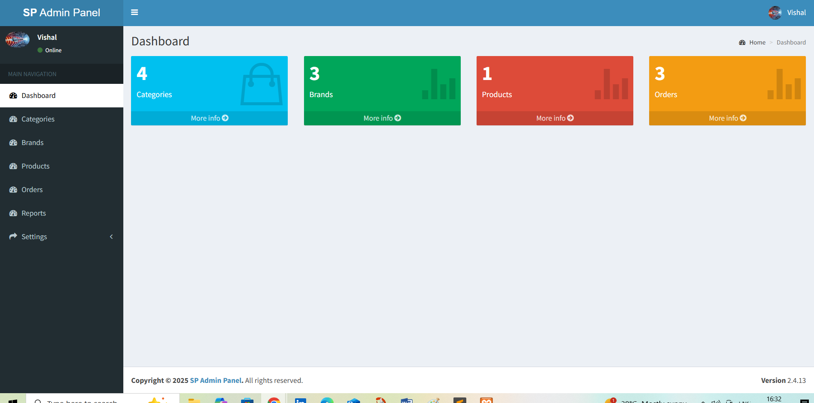
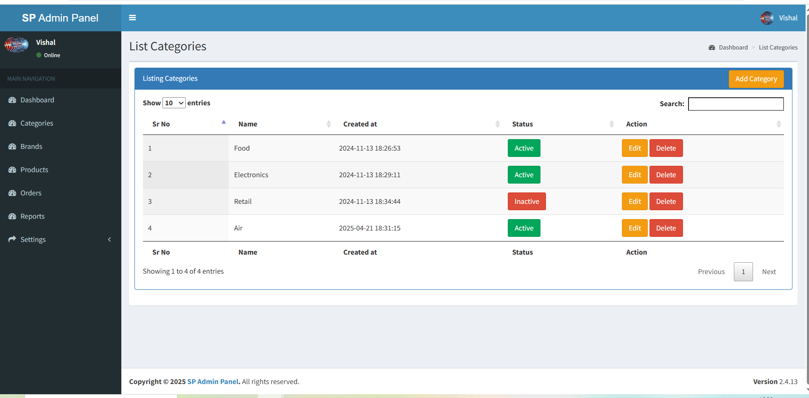
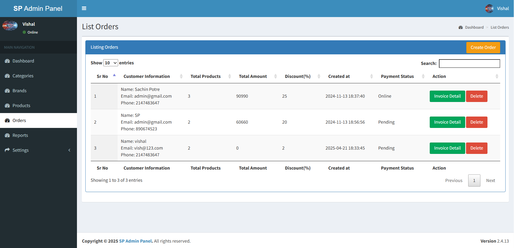

# 🔐 SP Admin Panel – CodeIgniter Admin Dashboard

The SP Admin Panel is a powerful admin interface built using CodeIgniter PHP MVC Framework. It covers essential modules for managing users, roles, products, orders, invoices, and reports. Designed to kickstart any new CodeIgniter-based web project.

## 🔧 Tech Stack
- HTML, CSS, Bootstrap
- JavaScript, jQuery, AJAX
- PHP, MySQL
- CodeIgniter 3.x
- PDF & Excel Export Libraries

## ✨ Features
- Secure Login/Logout with Forgot/Reset Password
- Role-based Access Control (RBAC)
- CRUD for Users, Categories, Products, Orders
- Invoice Generation + Export (PDF)
- Data Reports: Export to Excel, PDF, CSV
- File Upload + Admin Settings Panel
- Login History and Access Logs

## 🖥️ Demo & Screenshots
Coming soon…

## 📁 Folder Structure
See full repo layout for application and assets.

## 🖥️ Demo & Screenshots

Here are some key screens of the SP Admin Panel:

### 🔐 Dashboard Overview

### 📊 Category Overview

### 👥 Add brand Overviewt

### 📄 Invoice / Order Management

## 📦 Setup Instructions
1. Clone/download the repository
2. Import `spadmin.sql` in your MySQL DB
3. Set base URL in `config/config.php`
4. Set DB config in `config/database.php`
5. Run via XAMPP or live hosting

## 📌 Author
Developed by [Sachin Potre](https://github.com/sachinp72)
